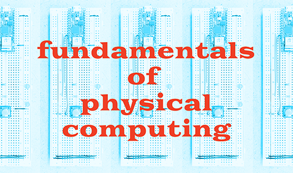

# IxD Physical Computing 🕹 Fall 2022

Syllabus for SVA MFA Interaction Design first year course, The Fundamentals of Physical Computing

Thursdays 02:00 PM - 04:50 PM, Visible Futures Lab (7th Floor)

[Class schedule](schedule.html) including session outlines, slides, readings and assignments.

 

## Instructors

Eric Forman (Office Hours Tuesdays and Thursdays 10:30am-1pm, 5pm-6pm; Fridays remote 11am-6pm): eforman1@sva.edu / [website](https://www.ericforman.com)

Viola He (Office Hours): viola@nyu.edu / [website](https://violand.xyz)

 

## Class Description

This course is a practical, hands-on exploration of physically interactive technology for designers. Students will examine how to interface objects and installations with the viewer's body and ambient stimuli, such as motion, light, sound and intangible data. Starting with the basics using the open-source Arduino platform, the class will move through electrical theory, circuit design, microcontroller programming and sensors, as well as complex output, including motors, video and intercommunication between objects. _Note: No previous programming or electronics experience is required._

 

## Class Expectation

**Attendance**: Participation in group discussions and collaborative assignments during workshop sections are an important part of the course, any unexcused absences will affect your grade. More than two unexcused absences and you risk failing the course. If you need to be absent for any reason, please give the instructors at least 24 hours of advanced notice.

**Assignments**: Each week you're expected to review and practice materials in lab assignments, complete project assignments, and document your progress and questions in your Physical Computing blog. There will be two group projects for midterm and final, which you will show on Week 7 and Week 14.

**Documentation**: Blog posts are due 23:59, Wednesday before each class. A good blog post should include ideation, design, circuit diagram/schematic, photos and videos of your process, and a showcase of the final result. Here're a couple of example blogs from past students for inspiration: [Young Kim](https://tremendous-angora-935.notion.site/Young-s-Blog-17ab8f05f52b422b8f774fd8405fdcc8) (Notion), [Awanee Joshi](https://medium.com/@awaneemjoshi/list/awanees-physical-computing-blog-posts-5a2cc296e9f8) (Medium), [Poonam Patel](https://www.poonampatel.me/physical-computing-blog) (page in personal website)

 

## Evaluation Criteria

Grading will be based primarily on effort and quality of assigned work (60%), research and practice outside of class (20%), and involvement in discussions and critiques (20%).

 

## Required Materials

All needed materials will be provided in a Student Kit, that will be billed as a Course Materials Fee. Students have the option of buying additional materials to fulfill their project objectives. Tools and consumable supplies will be available in the VFL and in IxD's studio.

Weekly readings are shared [here](https://drive.google.com/drive/folders/14_zAcMBffM56HMbXtn9Qqgk34ObHQrnm?usp=sharing).

 

## Recommended Readings

**CLASS SITE with resources and examples: www.hellocircuits.com**

 

**Technical - selections from:**

- Forest M. Mims III, Getting Started In Electronics (2003)
- Charles Platt, Make: Electronics (2009)
- Tom Igoe & Dan O’Sullivan, Physical Computing: Sensing and Controlling the Physical World with Computers (2005)
- Tom Igoe, Making Things Talk: Practical Methods for Connecting Physical Objects (2007)

**Conceptual & History - selections from:**

- Medien Kunst Netz, Overview of Media Art: Immersion, Communication, Milestones
- Söke Dinkla, The History of the Interface in Interactive Art (1994)
- Roy Ascott, Behaviourist Art and the Cybernetic Vision (1967), Back To Nature II: Art and Technology in the Twenty-First Century (1995), Telematic Embrace: Visionary Theories of Art, Technology, and Consciousness (2003)
- Billy Klüver, The Great Northeastern Power Failure (1966)
- Pam Meecham & Julie Sheldon, “From The Machine Aesthetic to Technoculture,” Modern Art: A Critical Introduction, 2nd Ed.(2005)
- David Rokeby, “Transforming Mirrors: Subjectivity and Control in Interactive Media,” Critical Issues in Interactive Media, ed. Simon Penny (1996)
- Sensorium: Embodied Experience, Technology, and Contemporary Art, ed. Caroline A. Jones (2006)
- Joke Brouwer, Arjen Mulder & Anne Nigten, aRt&D: Research and Development in Art (2005)
- Mark B. N. Hansen, Bodies In Code: Interfaces with Digital Media (2006)
- Jonatham Benthall, Science and Art as Modes of Enquiry (1972)

**Design - selections from:**

- Vilém Flusser, The Shape Of Things: A Philosophy of Design (1999)
- Donald Norman, The Design of Everyday Things (2002)
- Chris Crawford, The Art of Interactive Design (2002)
- Tor Nørretranders, The User Illusion: Cutting Consciousness Down To Size (1998)

 

## Schedule

Weekly schedule will be updated [here](schedule.html)

 

## Policies

### Academic Integrity

Academic dishonesty, including plagiarism, will not be tolerated. Students found to have committed an act of academic dishonesty will fail the assignment for which an infraction is suspected and substantiated. More serious violations will be handled through the process enumerated in the [SVA Handbook](https://sva.edu/students/life-at-sva/sva-handbook). Put simply, make sure your work is your own.

### Students with Disabilities

SVA is committed to providing students with access to their academic programs and courses. If you are a student with a disability and require accommodations, you must register with Disability Resources by visiting https://sva.edu/disabilityresources and completing an online accommodation request. To be eligible for accommodations in this course, students must provide the instructor with a letter of accommodation from Disability Resources. For questions or assistance, please call Disability Resources at 212-592-2396, or visit the office: 340 East 24th Street, New York, NY 10010, or email disabilityservices@sva.edu

### SVA Attendance Policy

The SVA Handbook says: The School of Visual Arts is a professional art college dedicated to teaching and learning. Attendance is required in all courses, and the individual faculty member determines the number of acceptable absences, if any. However, students who are marked absent for one-third of the sessions for a given course will be administratively withdrawn from the course with a grade of W.

### Pronouns and Chosen Names

Students may indicate their pronouns and preferred/chosen first name through MyServices; this information will then appear on class rosters (go to: https://myservices.sva.edu/Student/UserProfile and select "Edit Personal Identity").

Please let your instructor know the preferred name and pronouns by which you would like to be referred, if that information does not already appear on the roster. A student’s chosen name and pronouns should be respected at all times.
