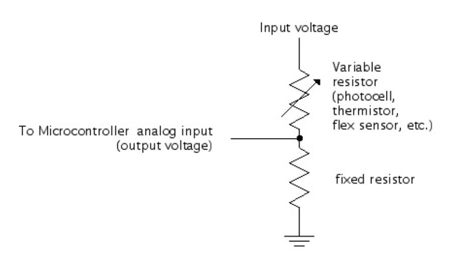

Variable resistors are components that are able to have their resistance adjusted, changing from zero to a maximum value. For example, potentiometer, the component you used in the [Arduino Basics Lab](Arduino-basics.html), is a varaible resistor. You can use them in a simple circuit with an LED to adjust brightness, or in a ***voltage divider circuit*** to be read by an Arduino, in order to produce different outputs. 

**Voltage dividers** are a commonly used circuit that outputs voltage proportional to the ratio between two resistors. For your purposes, this is used frequently to convert variable resistance into variable voltage, for the Arduino board to read as input. Read about it on [Hello Circuits](https://hellocircuits.com/2013/02/04/voltage-divider-circuit/) - Go over it slowly. Don't worry about the math, but do understand the basic concepts, and most importantly, how you can use this to make your own circuits.

Next, learn about the following components that offer variable resistance.

### Potentiometer

A potentiometer has a metal contact, called a wiper, slides along a resistor, deviding the resistor into two halves.

*second image from [ITP Physical Computing](https://itp.nyu.edu/physcomp/lessons/sensors-the-basics/)*

### Photocell

Unlike a potentiometer, most other variable resistors - like the photoresister (photocell) - only have one resistance that changes (which you can tell because there are only two pins to connect its endpoints, not three). So to make a voltage divider in those cases, you need to add a second resistor yourself

Read the Sparkfun guide on [using a photocell](https://learn.sparkfun.com/tutorials/photocell-hookup-guide/all).

### Stretch sensor, Flex sensor, Pressure sensor/FSR, etc.

There are many other sensors that use a variably resistive material. In the photo, a stretch sensor (top), and a pressure sensor/FSR (bottom) is made of conductive rubber, which changes resistence when it's being stretched or pressed. A flex sensor (middle) can be made of many different materials, and is used to measures the amount of deflection or bending.

When your completely kit arrive, you'll have a pressure sensor and a flex sensor at hand. Read the Sparkfun tutorials if you're interested in using them: [pressure sensor](https://learn.sparkfun.com/tutorials/force-sensitive-resistor-hookup-guide), [flex sensor](https://learn.sparkfun.com/tutorials/flex-sensor-hookup-guide)

Optional: If you really want to understand the theory behind voltage dividers, read the following links. Don't worry if this is too technical for you, what's important is knowing how to use it to help you make what you want to make.

https://learn.sparkfun.com/tutorials/voltage-dividers 
http://electronicsclub.info/vdivider.htm

### Lab Exercise

Note: Do this if your kit arrived by Tuesday! 

Hook up at least one, preferably two, variable resistors in a breadboard with power and ground and an LED. Remember to include a static resistor in series to protect the LED. See example circuit below. Practice using the multimeter to see how resistance changes as you manipulate the sensor.

If you're still unclear about how to use a multimeter: go back to the [multimeter lab](https://ixd-physical-computing.github.io/IxD-PhysicalComputing-22/Week-1/Practice-with-a-multimeter.html) from last week, and read [this](http://www.sciencebuddies.org/science-fair-projects/project_ideas/Elec_primer-multimeter.shtml) for a different take.
 
Tips: 
- Put in short extra wires on the same rows as the resistor legs (or other points plus ground if you are testing voltage) to provide extra places to probe with multimer
- Use alligator clips and/or other aids like tape and cardboard to keep the circuit connections stable while you read the multimeter.
- Prop up the multimeter using the stand in the back, or leaning on something, so you can easily see the display and adjust the mode knob while you work.
- Measure resistance with the power OFF. Measure voltage with the power ON.
 
Next, turn the power on and see how the LED brightness varies as you manipulate the sensor. Note how the dimmest and brightest behavior is different for each sensor because its resistance is different. Some go from 0 - 10,000 ohms. Some go from 300 - 30,000 ohms. Other factors such as ambient brightness with a photocell will also effect the resistance differently if you move the circuit to a different room.

Example Circuit with Pressure Sensor:

Blog about your findings and questions!

