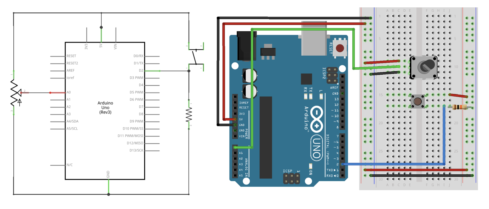
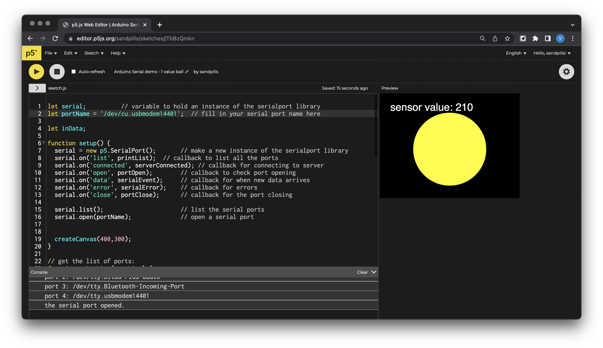
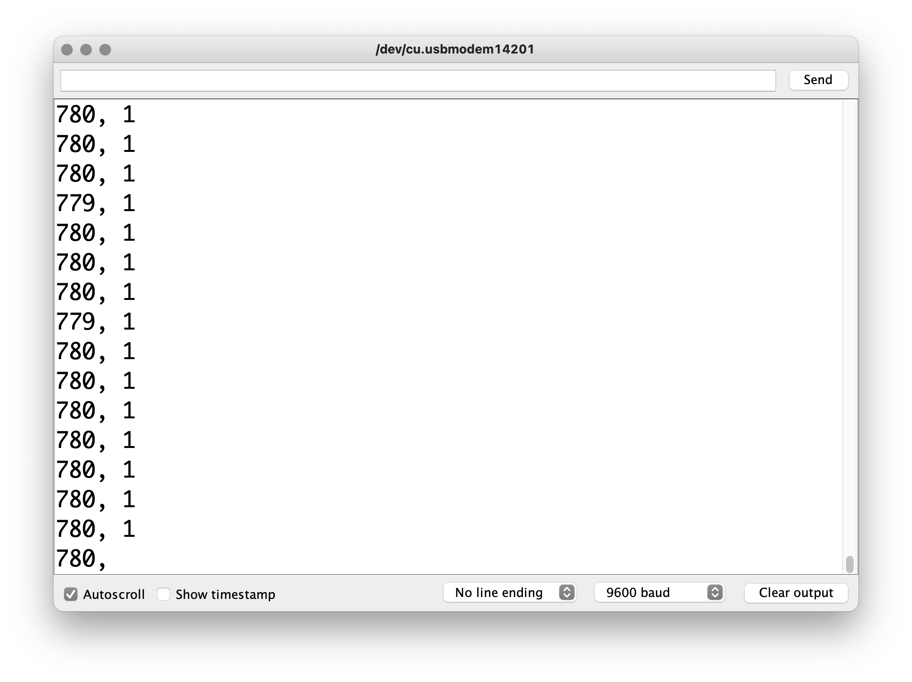

## Serial Output Lab

This week we covered Serial Communication - It's a lot of information to chew on, we'll resume next week to clarify and do more. Review the [week 5 lecture slides](https://docs.google.com/presentation/d/1SWo6lEEp1WgR5B6kxlWtKhT3AZTuQrvWmHjWDj5lxUg/edit#slide=id.g15f148ef1d0_0_0), and note any question you have.

In class we did the Async Serial Output Lab I (pp. 11 - 21). We've added in more instructional materials in the slides. Review the lab, and move on to try the Async Serial Output Lab II (pp. 22 - 30), where you'd send two values from the Arduino. You can follow this guide:

### Async Serial Output Lab II

**Arduino**

Bill of materials: Redboard board x1, Breadboard x1, Pushbutton x1, Potentiometer (the small blue thing) x1, 10k resistor x1, jumper wires a couple



Getting two or more values is the eventual goal, most of you will need this in the future. In this case, `Serial.write()` wouldn’t be able to fit much information, you need to use `Serial.print()`, and separate the values with a comma followed by a space.

In the Arduino code, print out the numbers of values one by one with `Serial.print()`, seperated by printing a comma `Serial.print(", ");`, and remember to add a new lane by using `Serial.println()` on your last value. In this example, we have two values to send out.

Full Arduino code:

```c
int potPin = A0;
int potVal;
int btnPin = 2;
int btnState;

void setup() {
  Serial.begin(9600);
}

void loop() {
  potVal = analogRead(potPin);
  btnState = digitalRead(btnPin);
  Serial.print(potVal);
  Serial.print(", ");
  Serial.println(btnState);
}
```

**Connection and p5.js**

Open p5.serialcontrol, and keep it open. Scan your ports to make sure the Serial port that connects to your Arduino is appearing in the Info panel. You're all set to communicate between Arduino and p5.js as long as you keep it open.

We're using this [p5 sketch](https://editor.p5js.org/sandpills/sketches/L2LESw-9E) for this example. Everything is setup already, but in order for you to use it, remeber to replace the `portName` variable (line 2) with your own port.



What's happening in the code? Let's break it down.

The `>` right underneth the Play / Stop buttons expands into your root files. You should see three:

- `index.html` is the "homepage" of your website, it's essential since p5 sketches are browser-based.
- `style.css` is the stylesheet that defines the look of your html page.
- `sketch.js` is the content within the html page, and is the main file where the p5 code happens.

You were only able to use p5 functions because there was a p5.js library `<script>`referenced in the `index.html` file -- and now to use Serial control, we'd also have to add a p5.serialport `<script>` that supports these functions. So navigate to the `index.html` file, and see that under the `<head>` tag and below the other scripts, I've added in:

```html
<script
  language="javascript"
  type="text/javascript"
  src="https://cdn.jsdelivr.net/npm/p5.serialserver@latest/lib/p5.serialport.js"
></script>
```

Now we're all set up for a p5.js sketch that can talk to other devides via Serial!

Back to the `sketch.js` file. We have a `setup()` function, in which we call `createCanvas()` to create a canvas 400px x 400px big.

```js
function setup() {
  createCanvas(400, 400);
}
```

In `setup()` we also need to add in [callback functions](https://www.w3schools.com/js/js_callback.asp) related to serial setups, which will be executed later in the code. You don't have to worry about them for now.

```js
function setup() {
  createCanvas(400, 400);

  // Serial setup

  serial = new p5.SerialPort(); // make a new instance of the serialport library
  serial.on("list", printList); // callback to list all the ports
  serial.on("connected", serverConnected); // callback for connecting to server
  serial.on("open", portOpen); // callback to check port opening
  serial.on("data", serialEvent); // callback for when new data arrives
  serial.on("error", serialError); // callback for errors
  serial.on("close", portClose); // callback for the port closing

  serial.list(); // list the serial ports
  serial.open(portName); // open a serial port
}
```

Most data receiving and formatting happens in the `serialEvent()` function later in the code (line 67-82).

Now, what we're getting from the Arduino are: a number between 0-1023, a comma and space, and a nother number between 0-1. And every set of new data shows up in a new line, as seen in the serial monitor:



In the `serialEvent()` function, the program is reading the incoming Serial information as strings, a sequence of characters, until it gets to carriage return (`\r`) and newline (`\n`). These characters are at the end of each new reading because we sent `serial.println()`, which automatically sends out a carriage return byte and a newline byte. It's an easy way to tell the program: hey it's a new line, that means we got through to the end of the current reading, now onto the next one.

After making sure there're strings to be read, we split the incoming string by commas, which we sent through `serial.println()`, seperating both readings. We split them up, and put both them in an array called `inputs`. From here, we can access those numbers by calling their array and position: `inputs[0]` and `inputs[1]`. We covered array briefly last week, refer back to last week's [slides](https://docs.google.com/presentation/d/1TEWKf08ljkA9GOH_bT8G4Q9h5Ixmfi7ORA9WDxmLus4/edit#slide=id.g13f4cc087c6_0_75) for a refresher.

```js
function serialEvent() {
  // read a String from serial port
  // until you get carriage return and newline:
  let inString = serial.readStringUntil("\r\n"); // store in a variable
  //check to see that there's actually a string:
  if (inString.length > 0) {
    let inputs = split(inString, ","); // split the value by commas, put into array
    if (inputs.length > 1) {
      // if there are two or more elements
      console.log(inputs[0], inputs[1]); // print the input values
    }
  }
}
```

then we could call our specific inputs for this sketch, and store them in variables. This is completely optional and can be done in the `draw()` function too, but I like to keept them defined before sending them there.

```js
potVal = map(inputs[0], 0, 1023, 0, width); // first element in the array
pressed = inputs[1]; // second element in the array
```

In the `draw()` function, the sketch gets drawn out, and we can add conditions to use the Serial data as interactive devices.

```js
function draw() {
  background(0);
  // change ball color on press
  if (pressed == 1) {
    // if pressed, color it blue
    fill(color(0, 0, 255));
  } else {
    // if not pressed, color it yellow
    fill(color(255, 255, 0));
  }
  noStroke();
  ellipse(width / 2, height / 2, potVal, potVal); // now draw the ellipse, size based on pot value
  // draw a line based on pot value
  stroke(255);
  strokeWeight(4);
  line(5, 5, potVal, potVal);
}
```

Hope it worked for you!! Try to change a couple parameters, or combine your own sketch you made for the [p5.js Lab](p5js-lab.html) with some Serial interaction! You can always copy the entire Serial section (line 48 onwards) and just change the `serialEvent()` function. Work with your midterm group if it makes it easier.
