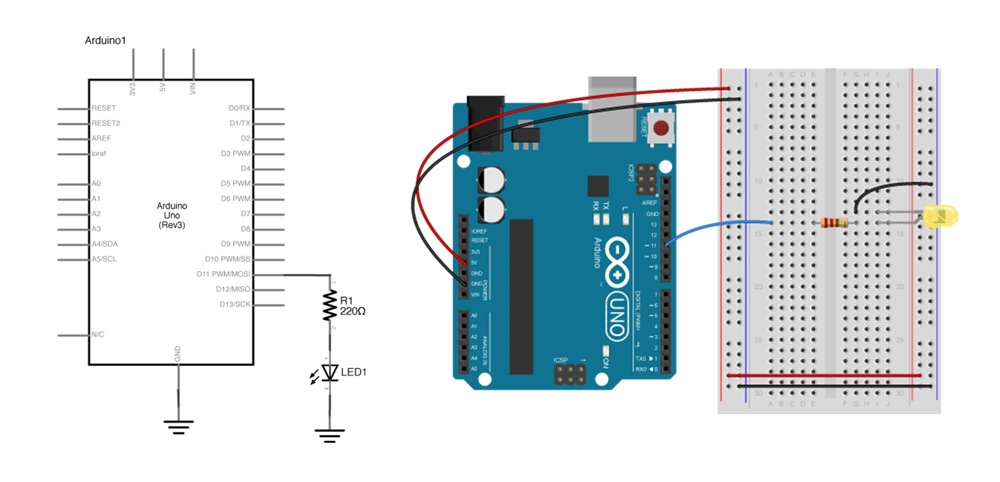
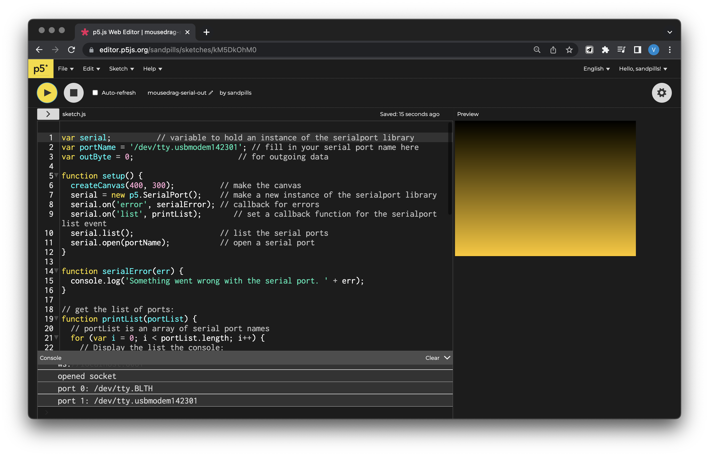

## Optional Lab: p5.js Serial Out to Arduino

We've demonstrated in class how you're able to establish Duplex (two-way) communication with Arduino and p5.js by handshaking (review it on the Week 9 lecture [slide](https://docs.google.com/presentation/d/1n_S3ss0V8yoHElHRGH3fwzL3Hb48LbnF2S3iw4Vmg_E/edit#slide=id.g17dc17132de_0_82)), where you used the `serial.write()` fuction in p5.js to send out bytes of information, and `Serial.read()` in Arduino to receive them. In this lab, you'll learn to send a byte from p5.js to Arduino, and use it to change the brightness of an LED.

This example is adapted from this [Lab](https://itp.nyu.edu/physcomp/labs/labs-serial-communication/lab-serial-output-from-p5-js/) from the ITP Physical Computing site, and this [tutorial](https://docs.arduino.cc/built-in-examples/communication/Dimmer) on the Arduino site. Follow both for more in-depth explanations.

**Arduino**

Bill of materials: Redboard x1, Breadboard x1, Pushbutton x1, LED x1, 220 Ohm Resistor x1, jumper wires a couple.

Connect the LED and resistor to digital I/O pin 11 of the board.



Program your Arduino to read the analog input as follows:

```c
const int ledPin = 11;

void setup() {
  Serial.begin(9600);           // initialize serial communications
  pinMode(ledPin, OUTPUT);
}

void loop() {
  if (Serial.available() > 0) { // if there's serial data available
    int brightness = Serial.read();   // read the most recent data (from 0 to 255), store in a variable
    analogWrite(ledPin, brightness);       // use it to set the LED brightness
  }
}
```

In this sketch, we store Serial data coming into the Arduino board into a variable, and use that to write led brightness.

**p5.js**

Open the p5.serialcontrol app, and keep it open. CLOSE THE ARDUINO SERIAL MONITOR as only one Serial port can be accessed at once. Scan your ports to make sure the Serial port that connects to your Arduino is appearing in the Info panel. You’re all set to communicate between Arduino and p5.js as long as you keep the app open.

We’re using [this](https://editor.p5js.org/sandpills/sketches/kM5DkOhM0) p5 sketch for this example. Everything is setup already, but in order for you to use it, remeber to replace the portName variable (line 2) with your own port.



**What's happening in the code? Let's break it down**

Most of the new things are happening in `mouseDragged()`, a [function native to p5.js](https://p5js.org/reference/#/p5/mouseDragged)

```js
function mouseDragged() {
  // map the mouseY to a range from 0 to 255:
  outByte = int(map(mouseY, 0, height, 0, 255));
  outByte = constrain(outByte, 0, 255);
  // send it out the serial port:
  serial.write(outByte);
  console.log(outByte);
}
```

Here we're mapping `mouseY` (also native to p5.js, a function reading your mouse's Y position relative to the sketch) values to a range from 0 to 255 in order to fit into a byte, and storing it in a global variable `outByte`, which was called in the beginning of the code.

by using `serial.write()`, you're sending data out, one byte at a time. In Arduino, these bytes are read by the `Serial.read()` function, which also only read information in bytes.

### Only one byte at a time

Now, this example only enables p5.js to send out one byte at a time (a value from 0 to 255), similar to how we first learned to send data from Arduino to p5.js. In order to send multiple numbers in ASCII-encoded strings, you can still use `serial.write()` on the p5.js end. However, if you want to convert multi-byte number strings to numeric values on the Arduino end, you’ll need a new function to read ASCII-encoded numeric strings called `parseInt()`. We're not going to get into this now, but if you're interested, [this thread](https://forum.arduino.cc/t/serial-input-basics/278284) on the Arduino Forum is very informative.
